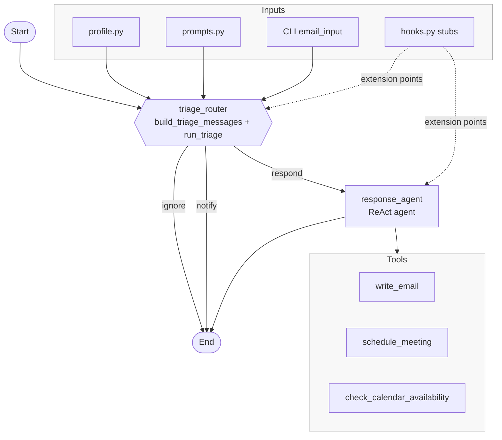
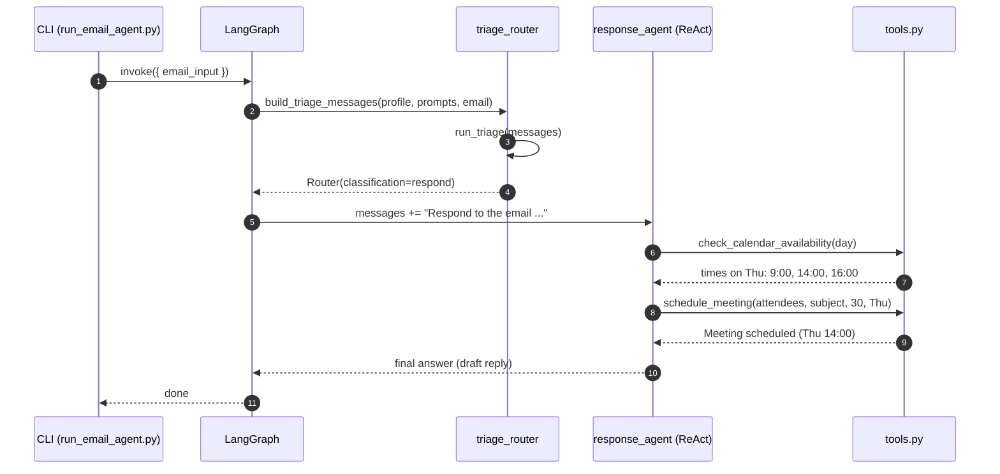

Email Agent Experiment

Overview
This experiment implements a lightweight email triage + response agent using LangGraph and LangChain. It:
- Classifies incoming emails into: ignore, notify, or respond.
- If respond, routes to a tool-using assistant that can draft replies and coordinate simple scheduling.
- Is designed to be easily customized via profile and prompt instructions.

Key components
- triage.py: Builds a structured-output prompt and calls a Google Gemini chat model to classify an email thread.
- graph.py: Small LangGraph that routes from triage to the response agent (or ends early for ignore/notify).
- agent.py: Creates a ReAct-style agent with tools and a system prompt.
- tools.py: Example tools exposed to the agent: write_email, schedule_meeting, check_calendar_availability.
- prompts.py: Prompt templates and default instruction snippets (triage rules and agent guidance).
- profile.py: The user profile injected into prompts (name, background).
- hooks.py: Hook points for adding memory (semantic/episodic). Currently no-op stubs.
- experiments/run_email_agent.py: CLI to run the full flow for a single email input.

Prerequisites
- Python 3.12+
- uv and just installed (see repository root README and guidelines).
- A Google Generative AI (Gemini) API key set in your environment.

Environment variables
- GOOGLE_API_KEY: required for the google_genai provider used by LangChain/LangGraph.
- MODEL (optional): model spec string. Defaults to google_genai:gemini-2.5-pro. You can override at runtime via --model.

Quick start
1) Setup environment
- just setup
- just install

2) Provide your API key
Create a .env file at the repo root or export the variable in your shell:
- echo "GOOGLE_API_KEY=YOUR_KEY" > .env
  or
- export GOOGLE_API_KEY=YOUR_KEY

3) Run the agent on a sample email
Using python directly:
- python experiments/run_email_agent.py \
    --author "Alice <alice@example.com>" \
    --to "John Doe <john@example.com>" \
    --subject "Quick sync this week?" \
    --body "Hey John, can we grab 30 minutes on Thursday afternoon to review the Q3 roadmap?"

Optionally select a model:
- python experiments/run_email_agent.py ... --model "google_genai:gemini-2.5-pro"

What you’ll see
- The triage step prints a classification, e.g., 📬 TRIAGE → respond.
- If respond, the graph routes to the tool-using agent which may call tools (simulated) and produce an answer.
- The script prints ✅ done on completion.

Architecture
- Triage (LLM with structured output via Pydantic) decides: ignore, notify, or respond.
- Router updates state and routes to END or response_agent accordingly.
- Response Agent is a ReAct agent that can call the following tools:
  - write_email(to, subject, content)
  - schedule_meeting(attendees, subject, duration_minutes, preferred_day)
  - check_calendar_availability(day)

Architecture diagram

Sequence diagram (respond path)

Customization
1) Profile
Edit experiments/email_agent/profile.py to set your identity and background:
- profile = {
    "name": "John",
    "full_name": "John Doe",
    "user_profile_background": "Senior software engineer leading a team of 5 developers",
  }

2) Triage rules and agent guidance
Adjust experiments/email_agent/prompts.py:
- prompt_instructions["triage_rules"]["ignore" | "notify" | "respond"] to tune classification examples.
- prompt_instructions["agent_instructions"] for the agent’s operating guidance.
- triage_system_prompt and agent_system_prompt if you want to change the templates or add few-shot examples.

3) Tools
Add or modify tools in experiments/email_agent/tools.py. Each @tool function is auto-registered in tools(). Keep side-effects safe or mock them in tests. Current tools simulate behavior and return strings.

4) Memory hooks
hooks.py contains MemoryHooks with read/write stubs. You can implement persistence for episodic transcripts or semantic facts, then pass the hooks instance into the graph. The CLI already instantiates MemoryHooks() and passes it to build_email_agent; wire your hooks inside graph.py or nodes as needed.

Models
- Default model in triage.py: google_genai Gemini (gemini-2.5-pro) via langchain.chat_models.init_chat_model.
- CLI default (--model) also targets google_genai:gemini-2.5-pro for the agent. You can try other providers supported by LangChain’s init functions if configured; ensure credentials match.

Testing notes
- Follow project guidelines:
  - just test to run pytest (if tests are present).
  - just lint and just format to run ruff.
- Keep unit tests hermetic; mock network calls or add marks to skip network in CI.

Troubleshooting
- Authentication errors: Ensure GOOGLE_API_KEY is set and readable (env or .env). The script calls load_dotenv() so .env at repo root is picked up.
- Import errors in tests: tests/conftest.py in this repo (when present) prepends repo root to sys.path. Mirror that if you add new tests here.
- Model name issues: If your account lacks access to gemini-2.5-pro, try another available Gemini model string and pass via --model and optionally update triage.py if needed.
- Tool side-effects: The bundled tools are placeholders. If you connect to real systems (email, calendar), sandbox and add confirmations.

Example invocations
- Ignore-like message:
  python experiments/run_email_agent.py \
    --author "Marketing <news@vendor.com>" \
    --to "John Doe <john@example.com>" \
    --subject "Our Fall Sale is here!" \
    --body "Save 50% on ..."

- Respond-like message with scheduling:
  python experiments/run_email_agent.py \
    --author "Alice <alice@example.com>" \
    --to "John Doe <john@example.com>" \
    --subject "Quick sync this week?" \
    --body "Can we do 30 minutes on Thursday afternoon?"

Directory layout
- experiments/email_agent/
  - README.md (this file)
  - agent.py
  - graph.py
  - hooks.py
  - profile.py
  - prompts.py
  - tools.py
- experiments/run_email_agent.py (CLI wrapper)

