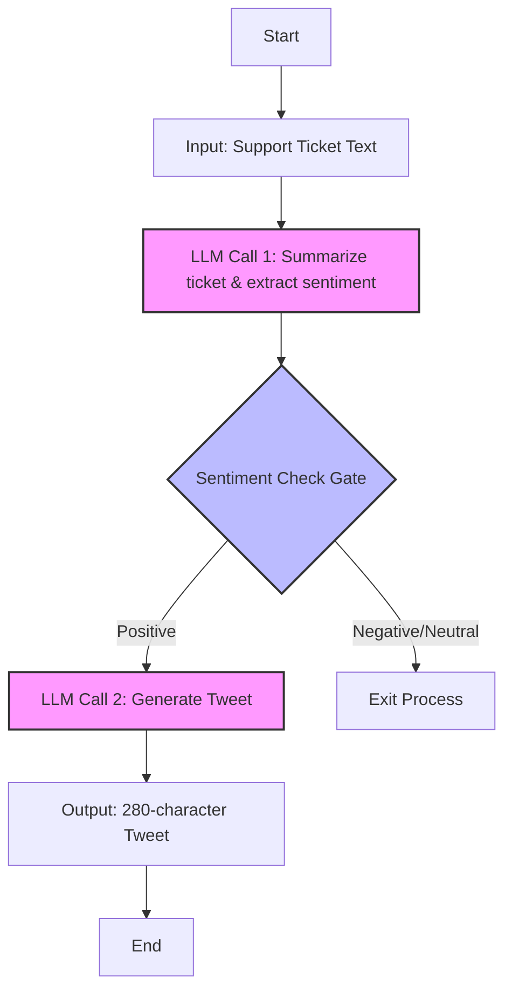

# 1. The Use Case for "Prompt Chaining" (The Simple Start)

## The Narrative

InnovateNow wants to start with a quick and simple win. They need a way to show they're listening to their customers
on social media.

### Context

Imagine a growing SaaS company, **InnovateNow Inc.** They have an innovative product and a passionate user base.
However, their small team is overwhelmed by the sheer volume of customer feedback coming from multiple channels (support
tickets, social media, surveys). They have a mountain of valuable data but lack the bandwidth to analyze it and turn it
into actionable insights.

Our mission, as architects and builders of "shovels," is to create an agentic system for InnovateNow. This system,
codenamed **"Project Sentinel"**, will act as an intelligent guardian, automatically analyzing customer feedback and
transforming it into valuable assets for the marketing and product teams.

## The User Story

> "As InnovateNow's Community Manager, I want a simple process that takes a support ticket about a resolved bug,
> extracts the core problem and customer sentiment, and generates a tweet draft to proactively communicate the
> solution."

**Why it's Perfect for Prompt Chaining:**
It's a linear and predictable workflow.

- **Step 1 (LLM Call 1):** Input: [Support ticket text]. Task: "Summarize this ticket in 3 key points and extract the
  customer sentiment (Positive, Negative, Neutral)."
- **Step 2 (Gate):** A programmatic check. `if (sentiment == "Positive") continue; else exit;`
- **Step 3 (LLM Call 2):** Input: [Summary and sentiment from Step 1]. Task: "Using this summary, draft a 280-character
  tweet in an empathetic and solution-oriented tone, announcing that the problem has been solved."

## The Architecture



This diagram shows the linear workflow for the "Prompt Chaining" pattern where:

- The process starts with a support ticket as input
- The first LLM call extracts key points and sentiment
- A programmatic gate checks if sentiment is positive
- If positive, the second LLM call generates a tweet; otherwise, the process exits
- The final output is a 280-character tweet in an empathetic tone

## How to run the agent (LangGraph implementation)

This example has a minimal, deterministic implementation (no external LLM/API keys required) under:

- patterns/01_prompt_chaining/langgraph_impl/app.py

We use Python 3.12+, uv, and just for workflow commands.

### 1) Setup the environment

- Install uv and just (see project README for links if needed)
- From the project root, create and prepare the virtual environment:

```
just setup
just install
```

This performs an editable install so you can import patterns.* directly.

### 2) Quick demo (Python one-liner)

From the project root, run:

```
python -c "from patterns.01_prompt_chaining.langgraph_impl import build_app; app = build_app(); print(app.invoke({ 'ticket': 'Customer reported a login bug yesterday. We shipped a fix overnight. User confirmed it\'s resolved and thanked the team.' }))"
```

You should see a dictionary output with keys: summary, sentiment, and for positive sentiment, tweet (<= 280 chars).

Example shape:

```
{
  'summary': '- ...\n- ...\n- ...',
  'sentiment': 'Positive',
  'tweet': 'We heard you and acted. ... #CustomerLove #ProductUpdate'
}
```

### 3) Interactive REPL snippet

Alternatively, open Python and run:

```
>>> from patterns.01_prompt_chaining.langgraph_impl import build_app
>>> app = build_app()
>>> state = app.invoke({"ticket": "Export failed intermittently; investigating. No resolution yet."})
>>> state
{'summary': '...', 'sentiment': 'Neutral'}
```

### 4) Validate via tests (optional)

```
just test
```

This runs pytest, which includes tests for the LangGraph implementation.

### Notes & Troubleshooting

- Ensure you ran just install before importing; it performs an editable install so that patterns/* can be imported.
- No API keys are needed — this implementation is heuristic and deterministic for local testing.
- If you use a different interpreter than the one in .venv, either activate it (just activate) or run the python
  commands using ./.venv/bin/python.
