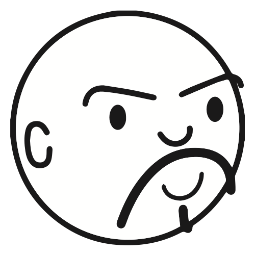

# The Story of the Lighthouse

## About Principia Agentica

Building AI agents today can feel like navigating a stormy sea at night. 

New frameworks and tools appear like a swarm of fleeting lights on the horizon, good technical documentation can be 
evasive as a sea mist, and the risk of running aground on a complex, unmaintainable architecture is very real.

**Principia Agentica was built to be a lighthouse.**

This project is a space dedicated to deep, practical, and honest exploration into the architectural patterns of AI
agents. 

Our mission is guided by a few core philosophies:

* **We Empower AI Builders:** Our focus is to cultivate the knowledge, make the comparisons, and develop code to 
  empower the AI builders.
* **Clarity Through First Principles:** We are not here to sell you a solution. We are here to build understanding from 
  the ground up. Like a lighthouse, our purpose is to provide a fixed point of reference—grounded in evidence, 
  architectural principles, and honest exploration—to help you navigate the complexities of AI development.
* **We Test for the "Day 100":** We believe the true test of an architecture is not its initial elegance, but its
  long-term resilience to change.

## About the Architect

{align=left width="200"}I'm Fabricio Q., an AI Systems & Agent Specialist. My journey in software has always been driven by a passion for
architecture—the art of building systems that are not only functional but also elegant, robust, and a pleasure to work
with.

After years of designing complex software systems, I've turned my full attention to the new frontier of AI agents. I
created Principia Agentica as my public laboratory, a place to deconstruct the hype and uncover the foundational
principles (`principia`) of good agentic design.

My approach is that of a humble craftsman and a curious explorer. I believe in learning in public, giving credit to the
community, and always prioritizing the "why" behind the "how".

You can follow my work and connect with me here:

* **LinkedIn:** [linkedin.com/in/matiasquaglia/](https://www.linkedin.com/in/matiasquaglia/)
* **GitHub:** [github.com/fmquaglia](https://github.com/fmquaglia)
