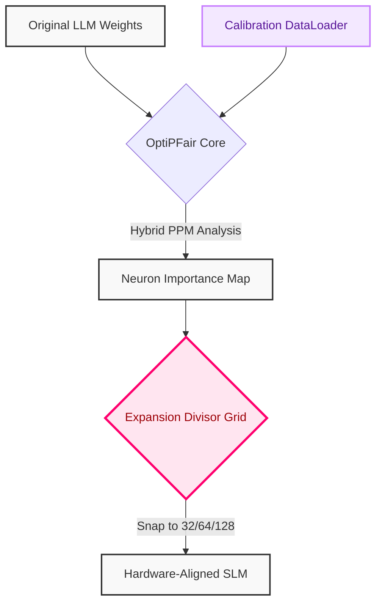

# The OptiPFair Series #2: Healing the Golden Scar — Hardware-Aware and Data-Driven Pruning

In our [first conversation](121525-slms-with-optipfair.md) with Pere Martra, the architect behind OptiPFair, we exposed a *golden scar* in the art of Small Language Models (SLMs). We noted a painful trade-off: width pruning, while surgically precise, fractured the native structure of the model. By arbitrarily slicing away neurons, the resulting tensors became jagged, falling out of step with the rigid, mathematical choreography that hardware accelerators (like Tensor Cores) demand to operate at peak efficiency. 

But in the Citadel, code is not stone; it breathes. Less than a season later, Pere returned to the forge. 

Today, we explore two massive architectural evolutions in OptiPFair: **Hardware-Aware Alignment** and **Data-Driven Pruning**. These are not mere patches; they are a profound paradigm shift. We are no longer just cutting away excess; we are sculpting the model to resonate perfectly with both the silicon it runs on and the specific data it consumes.

<!-- more -->

## Architecture (The Chassis)

The elegance of a system is measured by its ability to resolve opposing forces. OptiPFair introduces two new mechanisms to balance the chaos of pruning with the order of execution.

### 1. The Rhythm of Silicon: `expansion_divisor`

Hardware accelerators are not fluid; they are geometric. Tensor Cores crave symmetry, specifically dimensions that are multiples of 32, 64, 128, or 256. If you prune a layer down to 3,117 neurons, the hardware must pad the operation, wasting cycles and memory bandwidth. The waltz is broken.

OptiPFair heals this by introducing the `expansion_divisor`. When you prune the width of a GLU architecture, the algorithm doesn't just cut blindly. It calculates the optimal reduction and then mathematically snaps the intermediate layer size to the nearest allowed multiple. It acts as a harmonic grid, ensuring the pruned model retains the exact spatial proportions required to sing on modern hardware.

### 2. The Shift to Hybrid Resonance: Data-Driven Pruning

Until now, most pruning was **static**. The algorithm analyzed the raw weights of the network in isolation, much like judging a musician solely by looking at their sheet music. 

But a model's true nature is only revealed in motion. By introducing a `dataloader`, OptiPFair shifts to a **Hybrid** importance calculation. Powered by the Peak-to-Peak Magnitude (PPM) method—originally defined in Pere's foundational paper, [*Fragile Knowledge, Robust Instruction-Following: The Width Pruning Dichotomy in Llama-3.2*](https://arxiv.org/abs/2512.22671)—the engine now listens to the orchestra. 

It passes calibration data through the model and measures the active resonance (the peak-to-peak activations) of each neuron. Those that remain silent across the dataset are severed. This is extreme, context-aware specialization.



## Implementation (The Engine)

Let’s descend into the code. The implementation remains a single, devastatingly elegant granite block of logic. Notice the introduction of our two new parameters. 

!!! tip "Backward Compatibility"
    In the API, the PPM method is invoked using `neuron_selection_method="MAW"`. This preserves backward compatibility while executing the advanced Peak-to-Peak Magnitude logic.

```python title="prune_pipeline.py"
import torch
from torch.utils.data import DataLoader
from typing import Any
import optipfair as opf

def forge_specialized_model(
    model: torch.nn.Module, 
    calibration_dataset: Any
) -> tuple[torch.nn.Module, dict[str, Any]]:
    """
    Forges a specialized SLM by applying data-driven width pruning 
    while preserving hardware-aligned tensor dimensions.
    """
    
    # 1. Prepare the calibration data (The Silk)
    # We feed the model a taste of its future reality.
    dataloader = DataLoader(calibration_dataset, batch_size=8)
    
    print("Igniting the forge. Calibrating hybrid resonance...")
    
    # 2. Strike the anvil (The Steel)
    pruned_model, stats = opf.prune_model(
        model=model,
        pruning_type="MLP_GLU",
        neuron_selection_method="MAW", # Invokes Hybrid PPM
        pruning_percentage=40,
        expansion_divisor=64,          # Hardware alignment grid
        dataloader=dataloader,         # Triggers data-driven analysis
        show_progress=True,
        return_stats=True
    )
    
    return pruned_model, stats

# Execution will yield a model strictly aligned to multiples of 64
```

## Trade-offs (The Road Test)

We do not hide our scars. In the Citadel, we honor radical honesty. The power of data-driven pruning comes with two distinct prices:

1. **The Destiny of the Dataloader**: When you provide a calibration dataset, you are telling the model *exactly* what matters. If your `dataloader` contains exclusively Python code, the PPM method will likely prune the neurons responsible for generating French poetry. The model becomes a razor-sharp specialist, but it loses its generalist soul. You must curate your calibration data with the utmost architectural care.
2. **The Compute Tax**: Static pruning is instantaneous; it’s pure math on weights. Data-driven pruning requires a forward pass of your calibration data through the unpruned model to measure activations. It requires more compute upfront in the forge to save compute later in production.

By healing the structural fractures with the `expansion_divisor` and opening the model's eyes with a `dataloader`, OptiPFair transcends mere optimization. It becomes an instrument of pure architectural intention.

---
> *"Order is the highest form of beauty. Keep the thread taut and the heart light."*
