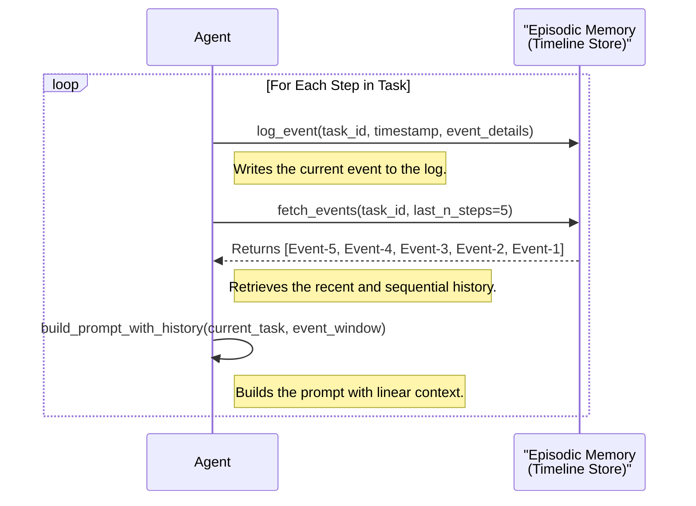
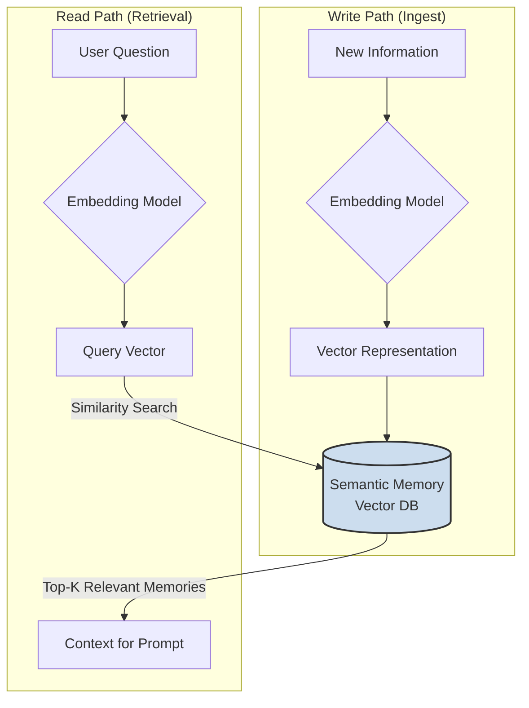
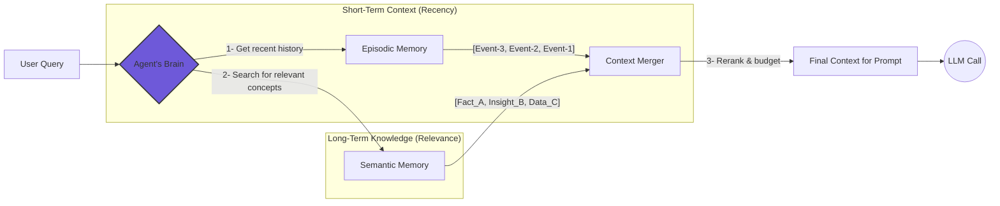
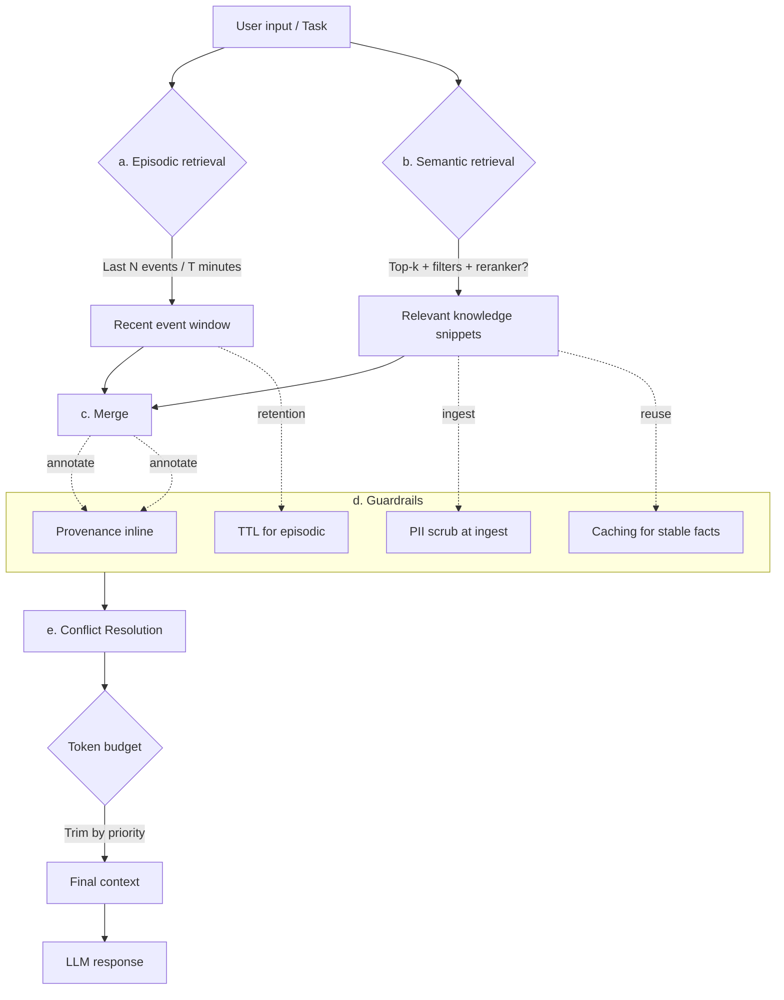

# Memoria en Agentes: Episódica vs. Semántica, y el Híbrido que Funciona

{align=left style="max-width: 200px; margin-right: 20px;"}

Muchos agentes fallan no por el modelo, sino por una “memoria” mal diseñada. Hay dos enfoques principales: la memoria episodica, un registro cronológico reproducible; y la memoria semántica, conocimiento destilado consultable por similitud.
Este micro‑artículo muestra patrones mínimos, trade‑offs y una receta híbrida que podés poner en producción esta semana.

<!-- more -->

<h2 style="clear: both;"> Introducción: El problema de la memoria y por qué tu agente se rompe</h2>

Los sistemas agénticos prometen un futuro de software autónomo e inteligente. Aun así, muchos proyectos prometedores se frenan ante una pregunta en apariencia simple:

> "¿Cómo recuerda el agente?"

Simplemente agrandar la ventana de contexto no es una estrategia sostenible; es fuerza bruta que choca rápido con los muros duros de latencia, costo y privacidad. **La memoria verdadera de largo plazo es la clave para construir agentes duraderos e inteligentes.**

El desafío es que “memoria” no es un único concepto. Para quienes construimos, se divide en dos paradigmas clave: **episódica** y **semántica**. Entender los trade‑offs entre ambas es el primer paso para diseñar un agente que aprenda, se adapte y rinda de forma confiable.

Elegir bien impacta en latencia, costo, privacidad y capacidad de evaluación. En este artículo desgloso ambos paradigmas y te doy una receta híbrida, práctica, que podés shipping ya para construir agentes realmente duraderos.

## Los dos paradigmas de la memoria en agentes

### **Memoria episodica (el cuaderno de bitácora):**

Es el registro lineal, con marca de tiempo, de los eventos del agente. Es una línea de tiempo append‑only de cada interacción, llamada de herramienta y observación. Pensalo como una transcripción judicial o la bitácora de un barco. Es barato y rápido de escribir, y la recuperación es determinista según tiempo o ID de tarea.

Esto lo hace perfecto para auditabilidad, debugging y reproducir flujos de tarea específicos. Para governance, redactar eventos puntuales o aplicar políticas de time‑to‑live (TTL) es directo.

### **Memoria semántica (la biblioteca de conocimiento):**

Es la base de conocimiento conceptual y asociativa del agente. Funciona convirtiendo información en representaciones numéricas (embeddings) y guardándolas en una base vectorial para una recuperación flexible. Pensalo como el fichero de una biblioteca o un grafo de conocimiento personal. Es más costoso al escribir, pero la recuperación es muy poderosa: permite encontrar información por similitud conceptual, no solo por keywords exactas.

Esta es la base para un RAG (Retrieval‑Augmented Generation) robusto y habilita generalización y síntesis creativa.

## Patrones mínimos de implementación

Hagámoslo tangible. Así se ven ambos patrones en pseudocódigo:

### **Memoria episodica (Timeline Store):**

*La memoria de trabajo de corto plazo de tu agente.*

```python
# 1. Log every event as it happens
log_event(task_id, timestamp, event_details)

# 2. Retrieve a recent window of events for context
event_window = fetch_events(task_id, last_n_steps=5)

# 3. Build the prompt with this linear history
prompt = build_prompt_with_history(current_task, event_window)
answer = LLM(prompt)

```



### **Memoria semántica (RAG sobre hechos):**

*La memoria conceptual de largo plazo de tu agente.*

```python
# 1. On write: embed and store a piece of information
embedding = embedding_model.embed(text)
vector_db.upsert(id, embedding, metadata={"source": "doc_A"})

# 2. On read: query by semantic similarity
query_embedding = embedding_model.embed(user_question)
relevant_memories = vector_db.search(query_embedding, top_k=3)

# 3. Build the prompt with retrieved context
answer = LLM(context=relevant_memories, question=user_question)

```



## La elección del arquitecto: la receta híbrida

No tenés que elegir. Los agentes más duraderos y sofisticados usan un enfoque híbrido, espejando cómo opera la mente humana.

- **Escribí en ambas:** Toda pieza de información se registra de forma episodica. Los insights clave o hechos destilados *también* se embeben y almacenan semánticamente.
- **Recuperá de ambas:** Para contexto inmediato y paso a paso, el agente tira de su log episodico reciente. Para conocimiento más amplio y conceptual, consulta su biblioteca semántica.
- **Merge y ranking:** Los resultados de ambas recuperaciones se mergean, se re‑rankean por relevancia y se podan para entrar en el budget de tokens de la ventana de contexto.



```python
# The agent needs to make a decision or respond to a question

def get_hybrid_context(task_id: str, user_question: str) -> list[str]:
    """
    Retrieves context from both episodic and semantic memory,
    and then merges the result
    """

    # --- 1. Episodic Retrieval (for recent context) ---
    # Gets the last 5 events from the current conversation or task.
    # It's fast, cheap, and gives us immediate history.

    episodic_memories = episodic_store.fetch_events(task_id, last_n_steps=5)

    # --- 2. Semantic Retrieval (for relevant knowledge) ---
    # Searches our knowledge base for concepts related to the question.
    # It's slower and more expensive, but finds long-reach knowledge.

    query_embedding = embedding_model.embed(user_question)
    semantic_memories = vector_db.search(
        query_embedding,
        top_k=5,
        filters={"task_type": "general_knowledge"}
    )

    # --- 3. Merging and Ranking (the brain of the system) ---
    # Combines both memory lists.

    combined_memories = episodic_memories + semantic_memories

    # (Optional but recommended) Re-ranks the combined results.
    # A re-ranking model can determine which memories are *most* relevant
    # to the specific question, given all options.

    reranked_memories = reranker_model.rerank(user_question, combined_memories)

    # --- 4. Token Budget (the reality guardian) ---
    # Ensures the final context doesn't exceed the LLM's token limit.
    # Removes less relevant memories until it fits.

    final_context = []
    total_tokens = 0
    TOKEN_BUDGET = 3000  # Token limit for context

    for memory in reranked_memories:
        memory_tokens = count_tokens(memory.text)
        if total_tokens + memory_tokens <= TOKEN_BUDGET:
            final_context.append(memory.text)
            total_tokens += memory_tokens
        else:
            break

    return final_context

# -- Use in the Agent ---

user_query = "Based on our last conversation, what's the main blocker for Project Sentinel?"
context = get_hybrid_context(task_id="project_sentinel_001", user_question=user_query)

final_prompt = build_prompt(context=context, question=user_query)
answer = LLM(final_prompt)

```

## Patrones mínimos de implementación

### Ejemplos del mundo real: cuándo usar cada uno

**Memoria episodica** (auditable y reproducible)

 - **Caso de uso:** Un agente de despliegue ejecutando un rollout multi‑paso entre servicios. Necesita un log de eventos reproducible para reanudar tras fallas y auditar quién hizo qué y cuándo.
 - **Patrón:** Timeline de eventos append‑only por tarea o sesión. Recuperar los últimos N pasos o una ventana por tag para reconstruir el contexto de ejecución de forma determinista.

**Memoria semántica** (recuperación y síntesis)

- **Caso de uso:** Un asistente de investigación respondiendo preguntas sobre especificaciones, issues y notas de reunión dispersas. Necesita búsqueda por similitud para aflorar conceptos que no matchean por keywords.
- **Patrón:** Embeddings de hechos/chunks destilados con metadata; recuperación k‑NN con filtros; reranker opcional antes del prompt.

**Híbrido** (sistemas durables, de grado humano)

- **Caso de uso:** Un copilot de soporte al cliente. Trae los últimos turnos de conversación y salidas de herramientas (episódico) mientras recuerda políticas y conocimiento de producto (semántico). Mergea, de‑dupea y entra en el budget de tokens.
- **Patrón:** Dual‑retrieval + guardrails en el merge. Es un poco más complejo pero vale la pena.
     1. **Retrieve episodic:** ventana de los últimos N eventos o últimos T minutos para la tarea/sesión activa.
     2. **Retrieve semantic:** top‑k snippets filtrados por tags de dominio; luego, reranker opcional.
     3. **Merge:** dedupe por source y hash; aplicar reglas de prioridad para budget de tokens.
     4. **Guardrails:** provenance inline, scrub de PII al ingest, TTL para episodic, caché para facts semánticos estables.
     5. **Resolución de conflictos:** preferí los facts episodicos más frescos; si chocan con política semántica, mostrálos ambos con una nota corta de resolución.



### Esquemas mínimos para copiar

```json5
// Episodic event
{
  "task_id": "deploy_2025_09_20",
  "ts": "2025-09-20T18:22:10Z",
  "type": "tool_call",
  "tool": "kubectl",
  "args": {"ns": "payments", "action": "rollout status"},
  "result": {"ok": true, "msg": "Deployment available"}
}

```

```json5
// Semantic memory metadata
{
  "id": "doc_42_para_7",
  "source": "runbook.md",
  "section": "rollback",
  "pii": false,
  "tags": ["policy","prod_v3"]
}

```

```json5
// Hybrid memory config (ties episodic + semantic at query time)
{
  "task_id": "deploy_2025_09_20",
  "episodic_window": {
    "mode": "last_n_events",
    "n": 5,
    "since_minutes": null,
    "filters": {"session_id": "sess_7"}
  },
  "semantic_retrieval": {
    "top_k": 5,
    "filters": {"tags": ["policy","prod_v3"], "pii": false},
    "reranker": {"enabled": true, "model": "cross_encoder_mini"}
  },
  "merge_policy": {
    "dedupe": "source+hash",
    "priority": ["episodic_recent", "semantic_policy"],
    "token_budget": 3000
  },
  "guardrails": {
    "provenance_inline": true,
    "pii_scrub_at_ingest": true,
    "episodic_ttl_days": 30,
    "semantic_cache_ttl_hours": 24
  },
  "conflict_resolution": "prefer_fresh_episodic_else_surface_both_with_note"
}
```

### Prompts demo que podés correr

1. Episodic (replay)
   > "Dados los últimos 5 eventos de la tarea deploy_2025_09_20, identificá la próxima acción segura y explicá por qué en dos oraciones. Si el último evento es un fallo, proponé un paso de rollback."
2. Semantic (recall)
   > "Usando la base de conocimiento, listá las 3 reglas de política más relevantes sobre reembolsos para planes anuales y citá su fuente y sección."
3. Hybrid (merge)
   > "Estás asistiendo a un agente de soporte. Mergeá los últimos 4 turnos de conversación con los top‑k snippets de políticas sobre reseteo de contraseña. Devolvé una única respuesta para el usuario y una checklist interna separada para el agente."

## La conclusión

No existe un único sistema de memoria “mejor”. La elección es una decisión arquitectónica. La memoria episodica es buena para auditabilidad y tareas paso a paso guiadas por herramientas. La memoria semántica es apropiada para recuperación de conocimiento y síntesis.

Construí un sistema híbrido para agentes realmente duraderos.

!!! tip

    **Elegí episodica para _auditorías_ y _pasos_; semántica para _recuperación_ y _síntesis_; híbrida para sistemas _durables_.**

## Qué sigue en `principia-agentica`

Este trade‑off teórico es apenas el comienzo. En mi próximo análisis comparativo completo, voy a estresar estos patrones de memoria en distintos frameworks.

**Vamos a medir el impacto real en latencia, costo por llamada ($/call) y calidad de recuperación para workloads como replay de tareas, Q&A sobre notas y grounding de herramientas.**

Estate atento. El laboratorio está abierto. 

_Podés seguir el avance en el [repositorio de GitHub de principia‑agentica](https://github.com/fmquaglia/principia-agentica)._ 

_...y si te resultó útil, compartilo con quien esté diseñando memoria para agentes. **¡Gracias!**_
