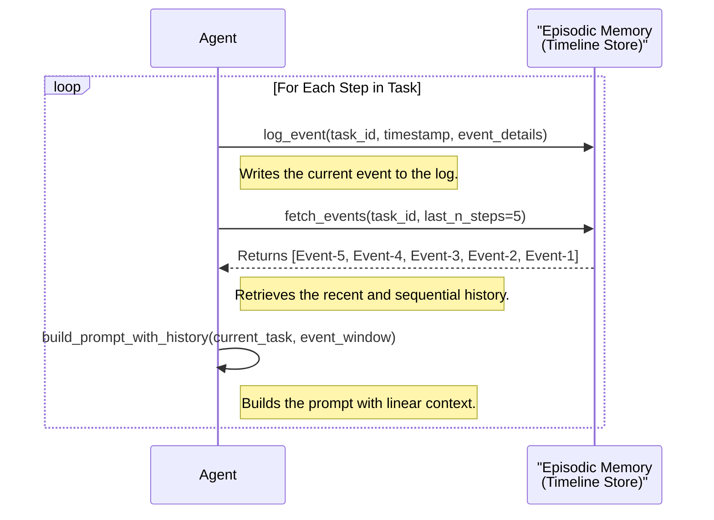
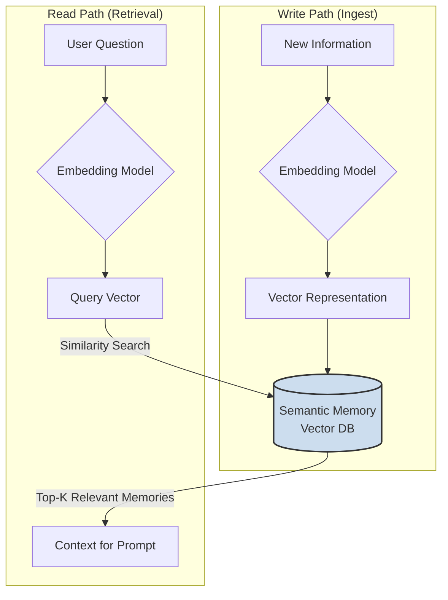
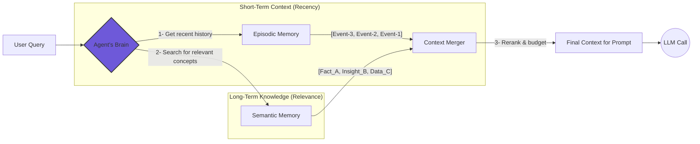
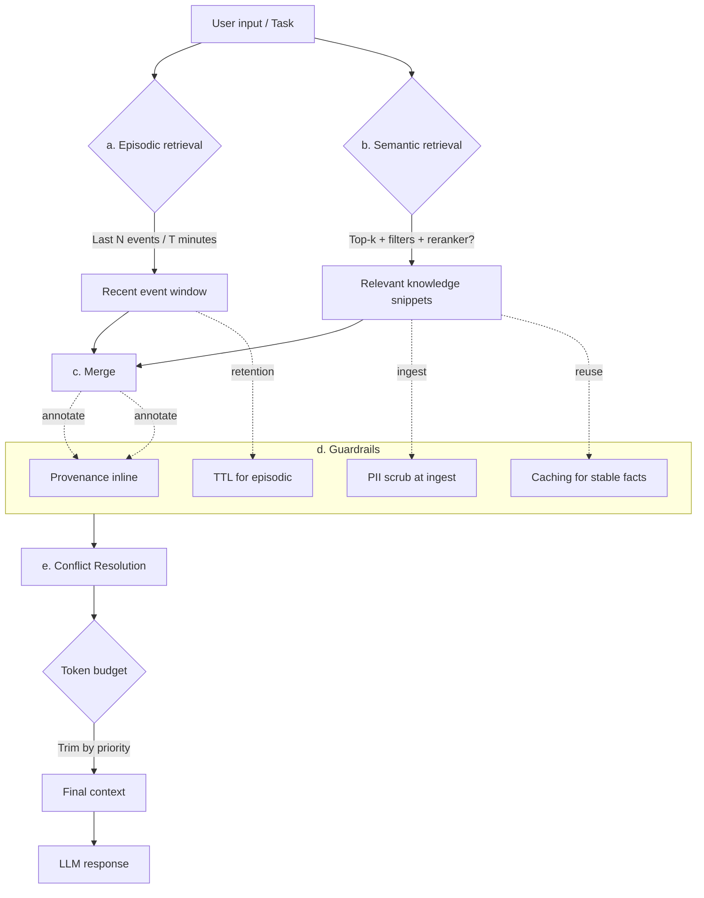

# Memory in Agents: Episodic vs. Semantic, and the Hybrid That Works

{align=left style="max-width: 200px; margin-right: 20px;"}

Many agents fail not because of the model but due to poorly designed 'memory'. There are two main approaches: episodic memory, a reproducible chronological log; and semantic memory, distilled knowledge queryable by similarity.
This micro-article shows minimal patterns, trade-offs, and a hybrid recipe that you can ship this week.

<!-- more -->

<h2 style="clear: both;"> Introduction: The Memory Problem And Why Your Agent Breaks</h2>

Agentic systems promise a future of autonomous, intelligent software. Yet, many promising projects stall when faced with
a deceptively simple question:

> "How does the agent remember?"

Simply expanding the context window is not a sustainable strategy; it's a brute-force approach that quickly runs into
the hard walls of latency, cost, and privacy. **True long-term memory is the key to building durable, intelligent
agents.**

The challenge is that "memory" isn't a single concept. For builders, it splits into two core paradigms: **episodic** and
**semantic**. Understanding the trade-offs between them is the first step to architecting an agent that can learn,
adapt, and perform reliably. 

Choosing well impacts latency, cost, privacy, and evaluation capability. In this article, I'll break down the two core 
memory paradigms and give you a practical, hybrid recipe you can ship this week to build truly durable agents.

## The Two Paradigms of Agent Memory

### **Episodic Memory (The Ship's Log):**

This is the agent's linear, time-stamped record of events. It's an append-only timeline of every interaction, tool call, 
and observation. Think of it as a court transcript or a ship's log. Writes are cheap and fast, and retrieval is 
deterministic, based on time or task ID. 

This makes it perfect for auditability, debugging, and reproducing specific task flows. For governance, redacting 
specific events or applying time-to-live (TTL) policies is straightforward.

### **Semantic Memory (The Knowledge Library):**

This is the agent's conceptual, associative knowledge base. It works by converting information into numerical 
representations (embeddings) and storing them in a vector database for flexible retrieval. Think of it as a library's 
card catalog or a personal knowledge graph. Writes are more computationally expensive, but retrieval is incredibly 
powerful, allowing the agent to find information based on conceptual similarity, not just exact keywords. 

This is the foundation for robust RAG (Retrieval-Augmented Generation) and allows for generalization and creative 
synthesis.

## Minimal Implementation Patterns

Let's make this tangible. Here is how these two patterns look in pseudocode:

### **Episodic Memory (Timeline Store):**

*Your agent's short-term, working memory.*

```python
# 1. Log every event as it happens
log_event(task_id, timestamp, event_details)

# 2. Retrieve a recent window of events for context
event_window = fetch_events(task_id, last_n_steps=5)

# 3. Build the prompt with this linear history
prompt = build_prompt_with_history(current_task, event_window)
answer = LLM(prompt)

```



### **Semantic Memory (RAG over facts):**

*Your agent's long-term, conceptual memory.*

```python
# 1. On write: embed and store a piece of information
embedding = embedding_model.embed(text)
vector_db.upsert(id, embedding, metadata={"source": "doc_A"})

# 2. On read: query by semantic similarity
query_embedding = embedding_model.embed(user_question)
relevant_memories = vector_db.search(query_embedding, top_k=3)

# 3. Build the prompt with retrieved context
answer = LLM(context=relevant_memories, question=user_question)

```



## The Architect's Choice: The Hybrid Recipe

You don't have to choose. The most durable and sophisticated agents use a hybrid approach, mirroring the human mind.

- **Write to Both:** Every piece of information is logged episodically. Key insights or distilled facts are then *also* embedded and stored semantically.
- **Retrieve from Both:** For immediate, step-by-step context, the agent pulls from its recent episodic log. For broader, conceptual knowledge, it queries its semantic library.
- **Merge and Rank:** The results from both retrievals are then merged, re-ranked for relevance, and trimmed to fit the context window's token budget.



```python
# The agent needs to make a decision or respond to a question

def get_hybrid_context(task_id: str, user_question: str) -> list[str]:
    """
    Retrieves context from both episodic and semantic memory,
    and then merges the result
    """

    # --- 1. Episodic Retrieval (for recent context) ---
    # Gets the last 5 events from the current conversation or task.
    # It's fast, cheap, and gives us immediate history.

    episodic_memories = episodic_store.fetch_events(task_id, last_n_steps=5)

    # --- 2. Semantic Retrieval (for relevant knowledge) ---
    # Searches our knowledge base for concepts related to the question.
    # It's slower and more expensive, but finds long-reach knowledge.

    query_embedding = embedding_model.embed(user_question)
    semantic_memories = vector_db.search(
        query_embedding,
        top_k=5,
        filters={"task_type": "general_knowledge"}
    )

    # --- 3. Merging and Ranking (the brain of the system) ---
    # Combines both memory lists.

    combined_memories = episodic_memories + semantic_memories

    # (Optional but recommended) Re-ranks the combined results.
    # A re-ranking model can determine which memories are *most* relevant
    # to the specific question, given all options.

    reranked_memories = reranker_model.rerank(user_question, combined_memories)

    # --- 4. Token Budget (the reality guardian) ---
    # Ensures the final context doesn't exceed the LLM's token limit.
    # Removes less relevant memories until it fits.

    final_context = []
    total_tokens = 0
    TOKEN_BUDGET = 3000  # Token limit for context

    for memory in reranked_memories:
        memory_tokens = count_tokens(memory.text)
        if total_tokens + memory_tokens <= TOKEN_BUDGET:
            final_context.append(memory.text)
            total_tokens += memory_tokens
        else:
            break

    return final_context

# -- Use in the Agent ---

user_query = "Based on our last conversation, what's the main blocker for Project Sentinel?"
context = get_hybrid_context(task_id="project_sentinel_001", user_question=user_query)

final_prompt = build_prompt(context=context, question=user_query)
answer = LLM(final_prompt)

```

## Minimal Implementation Patterns

### Real‑world examples: when to use what

**Episodic memory** (auditability and replay)

 - **Use case:** A deployment agent executing a multi‑step rollout across services. Needs a reproducible event log to resume after failures and to audit who did what, when.
 - **Pattern:** Append‑only event timeline per task or session. Retrieve last N steps or window by tag to rebuild execution context deterministically.

**Semantic memory** (recall and synthesis)

- **Use case:** A research assistant answering questions across scattered specs, issues, and meeting notes. Needs similarity search to surface concepts that aren’t keyword‑matched.
- **Pattern:** Embed distilled facts or chunks with metadata; k‑NN retrieval with filters; optional reranker before prompting.

**Hybrid** (durable, human‑grade systems)

- **Use case:** A customer support copilot. Pulls the last conversation turns and tool outputs (episodic) while also recalling policy and product knowledge (semantic). Merges, de‑dupes, and fits to token budget.
- **Pattern:** Dual‑retrieval + merge guardrails. This is a bit more complex but worth exploring in more depth.
     1. **Retrieve episodic:** window of last N events or last T minutes for the active task/session.
     2. **Retrieve semantic:** top‑k snippets filtered by domain tags, then optional reranker.
     3. **Merge:** dedupe by source and hash, enforce token budget with priority rules.
     4. **Guardrails:** provenance inlined, PII scrub at ingest, TTL for episodic, caching for stable semantic facts.
     5. **Conflict resolution:** prefer the freshest episodic facts; when conflicting with semantic policy, surface both with a short resolution note.



### Minimal schemas you can copy

```json5
// Episodic event
{
  "task_id": "deploy_2025_09_20",
  "ts": "2025-09-20T18:22:10Z",
  "type": "tool_call",
  "tool": "kubectl",
  "args": {"ns": "payments", "action": "rollout status"},
  "result": {"ok": true, "msg": "Deployment available"}
}

```

```json5
// Semantic memory metadata
{
  "id": "doc_42_para_7",
  "source": "runbook.md",
  "section": "rollback",
  "pii": false,
  "tags": ["policy","prod_v3"]
}

```

```json5
// Hybrid memory config (ties episodic + semantic at query time)
{
  "task_id": "deploy_2025_09_20",
  "episodic_window": {
    "mode": "last_n_events",
    "n": 5,
    "since_minutes": null,
    "filters": {"session_id": "sess_7"}
  },
  "semantic_retrieval": {
    "top_k": 5,
    "filters": {"tags": ["policy","prod_v3"], "pii": false},
    "reranker": {"enabled": true, "model": "cross_encoder_mini"}
  },
  "merge_policy": {
    "dedupe": "source+hash",
    "priority": ["episodic_recent", "semantic_policy"],
    "token_budget": 3000
  },
  "guardrails": {
    "provenance_inline": true,
    "pii_scrub_at_ingest": true,
    "episodic_ttl_days": 30,
    "semantic_cache_ttl_hours": 24
  },
  "conflict_resolution": "prefer_fresh_episodic_else_surface_both_with_note"
}
```

### Demo prompts you can run

1. Episodic (replay)
   > "Given the last 5 events for task deploy_2025_09_20, identify the next safe action and explain why in two sentences. If the last event is a failure, propose a rollback step."
2. Semantic (recall)
   > "Using the knowledge base, list the 3 policy rules most relevant to refunds for annual plans and cite their source and section."
3. Hybrid (merge)
   > "You are assisting a support agent. Merge the last 4 conversation turns with the top‑k policy snippets about password resets. Provide a single response to the user and a separate internal checklist for the agent."

## The Takeaway

There is no single "best" memory system. The choice is an architectural decision. Episodic memory is good for auditability and tool-driven, step-by-step tasks. Semantic memory is appropriate for knowledge recall and synthesis.

Build a hybrid system for truly durable agents.

!!! tip

    **Choose episodic for _audits_ and _steps_; semantic for _recall_ and _synthesis_; hybrid for _durable_ systems.**

## What's Next in `principia-agentica`?

This theoretical trade-off is just the beginning. In my upcoming full benchmark analysis, I'll be stress-testing these memory patterns across different frameworks.

**We'll measure the real-world impact on latency, cost-per-call ($/call), and retrieval quality for workloads like task replay, Q&A over notes, and tool grounding.**

Stay tuned. The lab is open. 

_You can follow the progress at the [principia-agentica GitHub repository](https://github.com/fmquaglia/principia-agentica)._ 

_...and if you found this helpful, share it with anyone designing agent memory. **Thank you!**_
