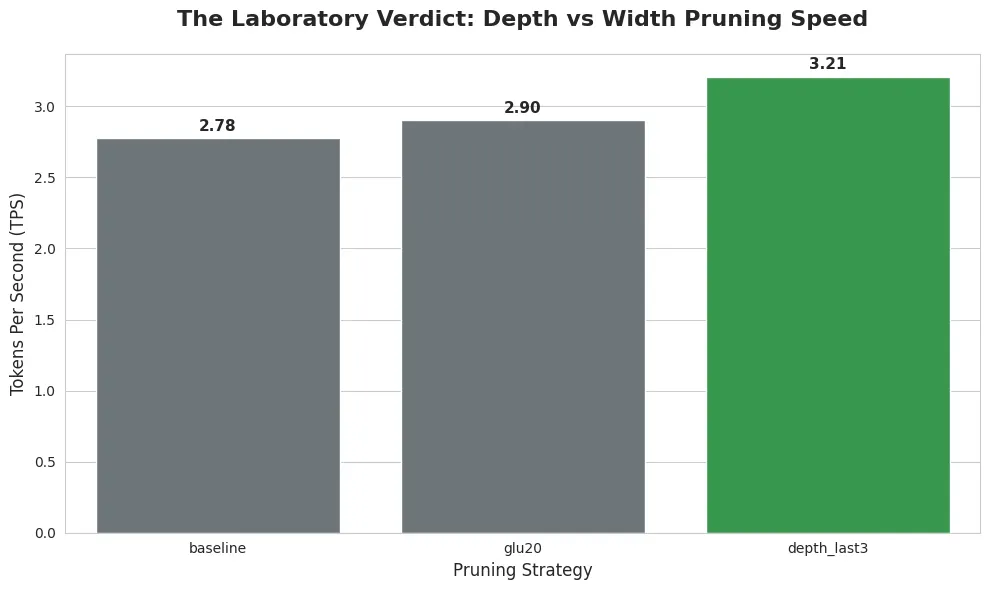

# The OptiPFair Series #1: Forging the Future with Small Models — An Architectural Analysis with Pere Martra

{align=left style="max-width: 200px; margin-right: 20px;"}

The AI race has been defined by a brutal metric: parameter count. 
But for those of us building real-world systems, the equation has changed. 
We've entered the era of efficiency. 
In this first episode of the OptiPFair Series, I sit down with Pere Martra—engineer, educator, and creator of OptiPFair to dissect not just his tool, but the philosophy behind it. 
From depth vs. width pruning benchmarks to surgical bias removal, this is an architect-to-architect conversation about building the next generation of Small Language Models. 
The future doesn't belong to giants. It belongs to specialists: small, fast, and fair.

<!-- more -->

## Introduction: When "Bigger" Stopped Being "Better"

We live in the age of giants—and perhaps we're witnessing their fall?

Over the past few years, the AI race has been defined by a brutal metric: the number of parameters. Bigger seemed, invariably, better. But for those of us building systems in the real world—those who have to deal with cloud budgets, real-time latency, and edge devices—the equation has changed.

We've entered the age of **efficiency**. The rise of *Small Language Models* (SLMs) isn't a passing fad; it's a necessary market correction. But how do we take these models and make them even faster, lighter, and fairer without destroying their intelligence in the process?

This is where **Pere Martra** and his new creation come in: **OptiPFair**.

Pere isn't an ivory tower academic. He's a seasoned engineer, a prolific educator (his LLM course repository is a must-read reference that I highly recommend), and above all, a pragmatic builder. I had the privilege of sitting down with him to dissect not just his tool, but the philosophy behind it.

What follows isn't a simple interview; it's a deep dive into the mind of an architect who is defining how we'll build the next generation of efficient AI.

---

## Act I: The Pragmatic Spark and the Secret of Productivity

The first thing I wanted to know was the origin. We often imagine that open-source libraries are born from grand theoretical epiphanies. Pere's story, however, is refreshingly human and pragmatic.

> **Fabricio Q:** Pere, OptiPFair is a sophisticated tool. What was the specific pain point or "spark" that led you to say "I need to build this"?

> **Pere Martra:** Well, it came from a technical test. They asked me to create an optimized version of a model and I decided to do *pruning*. From that test, I started researching, and over these months, SLMs have been gaining more importance and different papers have been appearing that I've based my work on. The most important one was from Nvidia that explained how they created their model families using *structured pruning* plus *knowledge distillation*.

---

## **The Architect's Analysis:**

This answer reveals two fundamental truths about good engineering:

1. **Innovation is born from necessity:** OptiPFair wasn't born looking for a problem; it was born solving one. That's the best guarantee of usefulness.
2. **Curiosity as a driver:** Pere didn't just pass the technical test. He used that challenge as a springboard to investigate the state of the art (Nvidia papers) and democratize that complex technology into an accessible tool.

But there's something deeper in Pere's way of working. When I asked him how he manages to maintain such high output—books, courses, libraries, private work—he revealed his personal "algorithm" for productivity.

> **Pere Martra:** "I try to leverage everything I do; everything I do has at least two uses. OptiPFair came from a commission... from that problem came a notebook for my course, and from that notebook came the library.When I do development, depending on how rushed I am: I can start with a notebook that goes to the course and from the notebook it moves to the library, or I go straight to the library to solve what needs to be known in the project and then, when I have time, that moves toward educational notebooks."

**The Takeaway:** For Pere, code is never an end in itself. It's a vehicle. **OptiPFair** is the crystallization of his knowledge, packaged so others can use it (*the library*) and understand it (*the book and the course*). It's the perfect cycle of learning and teaching.

---

# Act II: The Architectural "Sweet Spot" and the Ethics of Code

Once the origin was understood, it was time to talk architecture. The optimization ecosystem is full of noise. There are a thousand ways to make a model smaller (quantization, distillation, unstructured pruning). I asked Pere where exactly OptiPFair fits. His answer was a lesson in **knowing your terrain**.

> **Pere Martra:** "OptiPFair doesn't compete in the 70B parameter range. Its 'sweet spot' is sub-13B models, and specifically, deployment efficiency through **Depth Pruning**.Many width pruning methods theoretically reduce parameters, but often fail to improve actual inference speed in small batch scenarios (like local devices), because they break the memory alignment that GPUs love. By removing complete transformer blocks (*depth pruning*), we achieve hardware-agnostic acceleration."

## **From the Principia Agentica Laboratory: The Acid Test**

Inspired by this distinction, I decided not to stay in theory. I took OptiPFair to my own lab to test this premise with a 90-minute "Hello, Speedup" recipe.

Using a `Llama-3.2-1B` model as baseline, I ran two strategies:

1. **Width Pruning (MLP_GLU):** Reducing fine neurons.
2. **Depth Pruning:** Eliminating the last 3 layers of the model.

**The Laboratory Verdict:** The results validated Pere's thesis. While width pruning maintained the global structure more faithfully, **depth pruning delivered a significantly larger performance gain**: a 15.6% improvement in Tokens Per Second (TPS) compared to width pruning's 4.3%, with controllable quality degradation.

!!! example "Create new scratch file from selection"
    
    All benchmarks are documented in an interactive Jupyter notebook. 
    [Open in Colab](LINK) | [View on GitHub](LINK)

## **Visualizing the Invisible: Bias**

But speed isn't everything. And this is where OptiPFair plays its hidden card. Pere showed me a demo that left me frozen. It wasn't about TPS, it was about **ethics**.

> **Pere Martra:** "It's not enough to make the model fast. We need to know if pruning it amplifies biases. OptiPFair includes a bias visualization module that analyzes how layers activate in response to protected attributes."

He shared an example with a recent `Llama-3.2` model. Given a prompt about a Black man in an ambiguous situation, the original model hallucinated a violent response (a shooting). After surgical intervention using OptiPFair's analysis tools—removing just 0.1% of specific neurons—the model changed its response: the police officer no longer shot, but called for help.

**The Architect's Analysis:** This is a game-changer. Normally, we treat "ethics" and "optimization" as separate silos. Pere has integrated them into the same toolbox. He reminds us that an "efficient" model that amplifies prejudices isn't production-ready; it's a liability risk.

---

## Act III: "We're Going to Run Out of Planet" and the Master's Advice

Toward the end of our conversation, the discussion turned to the future. I asked Pere where he thinks all this is going. His answer was a sobering reminder of why efficiency isn't just a cost issue, but a sustainability one.

> **Pere Martra:** "If for every specific need we use a 700 billion parameter model... we're going to run out of planet in five years. We need generalist models, yes, but the future belongs to specialists: small models, fast and consuming less."

This vision drives OptiPFair's *roadmap*. It doesn't stop here. Pere is already working on **Knowledge Distillation** and **attention layer pruning**, seeking that holy grail where a small model doesn't just mimic a large one, but competes with it in its niche.

### **Deep Dive: Notes for the Advanced Architect**

Before closing, I took the opportunity to ask Pere some "architect to architect" questions about the technical limits of these techniques. Here are the key *insights* for those who want to take this to production:

- **Is there a "safe" pruning range?** It depends drastically on the family. "Llama handles MLP layer pruning very well (up to 400% of original expansion), while families like Gemma are more fragile. The safe limit usually hovers around 140% remaining expansion, but it will almost always require a recovery process (retraining or distillation)".
- **The "Last" layers heuristic:** Although depth pruning often targets the last layers, Pere clarified that this is an oversimplification. The recommended practice is to protect the first 4 blocks (fundamental for input processing) and the last 2 (essential for output consolidation). The "fat" is usually in the middle.

### **The Final Advice: Top to Bottom**

To finish, I asked for advice for engineers who are starting out in this dizzying field. His answer validates the path many of us are taking.

> **Pere Martra:** "Don't get bored. Study from top to bottom. Start using an API, doing something easy that you like. Once you have it, go down. Go to the foundations. Understand how a Transformer works, what a GLU structure is. Those 'aha!' moments when you connect practice with theory are what make you an expert."

---

## Conclusion: The Lighthouse Verdict

**OptiPFair** isn't just another library in the Python ocean. It's a statement of principles.

For the modern AI architect, it represents the perfect tool for the "Edge AI" and efficiency era. If your goal is to deploy language models in constrained environments, controlling both latency and ethical bias, this is an essential piece in your toolbelt.

!!! tip "What I take away from Pere"
  
    The most sophisticated technology is born from the simplest pragmatism. You don't need to start with a grand theory; you need to start solving a real problem. And if in the process you can teach others and build tools that make work fairer and more efficient, then you're building a legacy.

The `principia-agentica` laboratory approves and recommends **OptiPFair**.

---

## Resources and Next Steps

**I want to use OptiPFair. Where do I start?**

- **Official OptiPFair repository:** [github.com/peremartra/optipfair](http://github.com/peremartra/optipfair)
- **Pere's complete LLM course (free):** An educational treasure that covers from fundamentals to advanced techniques. Highly recommended. https://github.com/peremartra/Large-Language-Model-Notebooks-Course
- **"Large Language Models" book (Apress, 2024):** Pere's definitive guide on LLMs, now available. https://link.springer.com/book/10.1007/979-8-8688-0515-8
- **Upcoming book with Manning:** Pere is working on a book about model architecture and optimization that will delve deeper into OptiPFair and related techniques. Stay tuned.

## **Connect with Pere Martra:**

- **LinkedIn:** Follow his updates on OptiPFair, SLMs, and the future of efficient AI
  - https://www.linkedin.com/in/pere-martra/
- **Hugging Face:** Explore his optimized models and experiments with SLMs
  - https://huggingface.co/oopere
- **Medium:** Read his articles on model optimization and advanced ML techniques
  - https://medium.com/@peremartra
- **Community:** Pere is an active mentor at [DeepLearning.AI](http://DeepLearning.AI) and regularly contributes to TowardsAI

**If you found this article useful:**

- Try OptiPFair in your next optimization project
- Share this analysis with your ML team
- Consider supporting Pere's open source work by giving it a star on GitHub
- Follow Principia Agentica's work for more in-depth architectural analyses

Efficiency isn't just a technical metric. It's a commitment to a sustainable future for AI. Pere Martra is leading that path, one line of code at a time.

!!! note "Editor's Note (December 2025)"
  
    While this article was being prepared for publication, Pere released significant improvements to OptiPFair that address precisely the memory alignment limitation mentioned.
    
    Now `width pruning` supports the `expansion_divisor` parameter (32, 64, 128, 256) to respect tensor core size, and accepts a `dataloader` for data-driven neuron selection. This demonstrates the speed of OptiPFair's evolution.
    
    A complete update will come in the OptiPFair Series from Principia Agentica.

